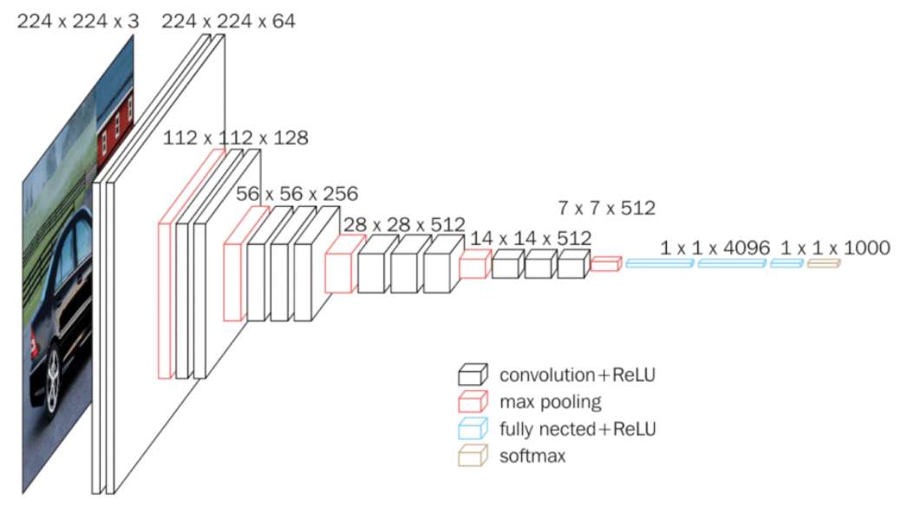
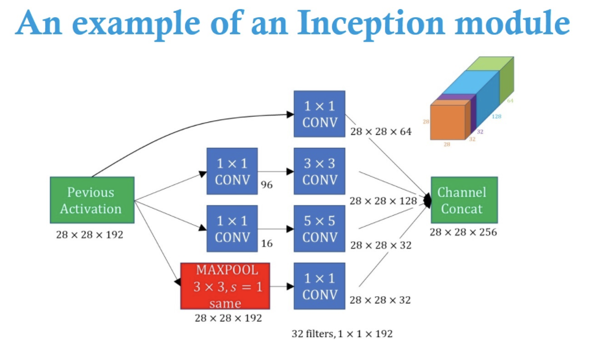

# Popular CNN architectures

`Timeline of CNN architectures discussed below:`

## LeNet
The LeNet architecture is one of the classic architectures of a CNN.
It consists of only seven layers(3 convolutional layers, 2 pooling layers, 1 fully connected layer, and 1 output layer).
It uses a 5 x 5 convolution with a stride of 1, and uses average pooling. 

LeNet-5(1998) is a simple architecture with 2 convolutional and 3 fully-connected layers.  This architecture has about 60,000 parameters. 
[Paper by Yann LeCun, Léon Bottou, Yoshua Bengio, and Patrick Haffner](https://scholar.google.nl/scholar?hl=en&as_sdt=0%2C5&q=Gradient-Based+Learning+Applied+to+Document+Recognition&btnG=) 

- This architecture has become the standard ‘template’: stacking convolutions and pooling layers, and ending the network with one or more fully-connected layers.

## AlexNet(2012)
AlexNet is a classic and powerful deep learning architecture. It won the ILSVRC 2012 by significantly reducing the error rate from 26% to 15.3%. 
ILSVRC stands for ImageNet Large Scale Visual Recognition Competition, which is one of the biggest competitions focused on computer vision tasks, such as image 
classification, localization, object detection, and more.

ImageNet is a huge dataset containing over 15 million labeled, high-resolution images, with over 22,000 categories. 
AlexNet was designed by [Alex Krizhevsky, Geoffrey Hinton, and Ilya Sutskever](https://papers.nips.cc/paper/4824-imagenet-classification-with-deep-convolutional-neural-networks).
It consists of 5 convolutional layers and 3 fully connected layers and 60 million parameters.

- They were the first to implement Rectified Linear Units (ReLUs) as activation functions instead of the tanh function, and ReLU is applied after every layer. 

It uses dropout to handle overfitting, and dropout is performed before the first and second fully connected layers. It uses data augmentation techniques, such as image translation, and is trained using batch stochastic gradient descent.

## VGGNet-16(2014)
VGGNet is one of the most popularly used CNN architectures. It was invented by the Visual Geometry Group (VGG) at the University of Oxford. It started to get 
very popular when it became the first runner-up of ILSVRC 2014.

It consists of convolutional layers followed by a pooling layer and then again convolutional layers followed by pooling layers. It uses 3 x 3 convolution and 
2 x 2 pooling throughout the network. It is referred to as VGG-n, where n corresponds to a number of layers, excluding the pooling and softmax layer. 
An example value of n is 16(13 convolutional and 3 fully connected layers). It carried onwards the ReLU tradition from AlexNet.

It consists of 138M parameters and takes up about 500MB of storage space. They also designed a deeper variant, VGG-19.

-  the contribution from this paper is the designing of deeper networks (roughly twice as deep as AlexNet).
[Paper by  Karen Simonyan, Andrew Zisserman](https://arxiv.org/abs/1409.1556)

## GoogleNet
GoogleNet, also known as inception net, was the winner of ILSVRC 2014. It consists of various versions, and each version is an improved version of the previous 
one. We will explore each version one by one.

### Inception V1(2014)
Consider a problem where objects can appear on any region of the image. It might be small or big. It might take up a whole region of the image, or just a very small portion. Our network has to exactly identify the object. We use a filter to extract features from the image, but because the object of interest varies in size and location in each image, choosing the right filter size is difficult.

We can use a filter of a large size when the object size is large, but a large filter size is not suitable when we have to detect an object that is in a small corner of an image. Since we use a fixed receptive field that is a fixed filter size, it is difficult to recognize objects in the images whose position varies greatly. We can use deep networks, but they are more vulnerable to overfitting.

To overcome this, instead of using a single filter of the same size, the inception network uses multiple filters of varying sizes on the same input. An inception network consists of nine inception blocks stacked over one another.

For one of the inception blocks/mudules, we perform convolution operations on a given image with three different filters, that is, 1 x 1, 3 x 3, and 5 x 5. Once the convolution operation is performed by all these different filters, we concatenate the results and feed it to the next inception block. Padding is appropriately added to keep the height and width the same across filters since they will simply be concatenated at the end. However, this concatenation results in increasing depth, so we need to adjust the nummber of filters so that the concatenation of filters doesn't increase the depth. The design of the architecture of an Inception module is a product of research on approximating sparse structures.

A 1\*1 filter is added before the 3\*3 and 5\*5 layers so as to lessen the number of operations. The 1\*1 operation does result in increased number of parameters to train(due to the addition of the weights of 1\*1 filters), however the net number of operations in convolution are greatly lessened as discussed [here](https://medium.com/coinmonks/paper-review-of-googlenet-inception-v1-winner-of-ilsvlc-2014-image-classification-c2b3565a64e7). The net result is decrease in complexity. The 1\*1 is used with relu so it also increases non-linearity as discussed in the paper [Network in Network](https://arxiv.org/abs/1312.4400).

As the inception network is deep, with nine inception blocks, it is susceptible to the vanishing-gradient problem.  To avoid this, we introduce classifiers between the inception blocks. This is done at the end of the 3rd and the 6th block and the loss from these classifers is called the auxillary loss wich is weighted and added to the final layer loss. The auxillary classifiers are used to increase the gradient signal that gets propagated back, and to provide additional regularisation. In total it is a 22-layer architecture with 5M parameters. 

[Paper :  Going Deeper with Convolutions](https://arxiv.org/abs/1409.4842)

## Inception v3(2015)
Inception-v3 is a successor to Inception-v1, with 24M parameters. Wait where’s Inception-v2? Don’t worry about it — it’s an earlier prototype of v3 hence it’s very similar to v3 but not commonly used. 

In these networks, factorized convolution is used i.e. we can break down a convolutional layer with a larger filter size into a stack of convolutional layers with a smaller filter size. So, in the inception block, a convolutional layer with a 5 x 5 filter can be broken down into two convolutional layers with 3 x 3 filters.
Having a factorized convolution increases performance and speed(in which cases ?). The authors also suggest breaking down a convolutional layer of filter size n x n into a stack of convolutional layers with filter sizes 1 x n and n x 1. However, that results in expanding our network in a deeper fashion, which will lead to loss of information. So, instead of making it deeper, we make our network wider.

In inception net v3, we use factorized 7 x 7 convolutions with RMSProp optimizers. Also, they applied batch normalization in the auxiliary classifiers.

- They were among the first designers to use batch normalisation

[Paper: Rethinking the Inception Architecture for Computer Vision](https://arxiv.org/abs/1512.00567)

## ResNet-50 (2015)
From the past few CNNs, we have seen nothing but an increasing number of layers in the design, and achieving better performance. But “with the network depth increasing, accuracy gets saturated (which might be unsurprising) and then degrades rapidly.” The folks from Microsoft Research addressed this problem with ResNet — using skip connections (a.k.a. shortcut connections, residuals), while building deeper models. Such skip connections are also known as gated units or gated recurrent units and have a strong similarity to recent successful elements applied in RNNs. Thanks to this technique they were able to train a NN with 152 layers while still having lower complexity than VGGNet.

The basic building block for ResNets are the conv and identity blocks. They have 26 million parameters.

- They popularised skip connections (they weren’t the first to use skip connections).
- They designing even deeper CNNs (up to 152 layers) without compromising model’s generalisation power
- Among the first to use batch normalisation.

[Paper: Deep Residual Learning for Image Recognition](https://arxiv.org/abs/1512.03385)

## Xception (2016)
Xception is an adaptation from Inception, where the Inception modules have been replaced with depthwise separable convolutions. It has also roughly the same number of parameters as Inception-v1 (23M).

Xception takes the Inception hypothesis to an eXtreme (hence the name). What’s the Inception hypothesis again? Thank goodness this was explicitly and concisely mentioned in this paper (thanks François!).
- Firstly, cross-channel (or cross-feature map) correlations are captured by 1×1 convolutions.
- Consequently, spatial correlations within each channel are captured via the regular 3×3 or 5×5 convolutions.

Taking this idea to an extreme means performing 1×1 to every channel, then performing a 3×3 to each output. This is identical to replacing the Inception module with depthwise separable convolutions.

- They introduced CNN based entirely on depthwise separable convolution layers.

[Paper: Xception: Deep Learning with Depthwise Separable Convolutions, Author: François Chollet, Google](https://arxiv.org/abs/1610.02357)

- Depth seperable convolutions are expained in .\seperable-convolutions.md 

## Others 
Some others like "Inception-v4 (2016)", "Inception-ResNet-V2 (2016)" and "ResNeXt-50 (2017)" can be found in the ref below.

### Other Refs
- [10 illustrated CNN architectures](https://towardsdatascience.com/illustrated-10-cnn-architectures-95d78ace614d#a253)

