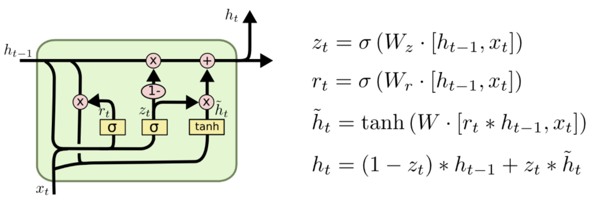

# Gated Recurrent Unit(GRU)
So far, we have learned about how the LSTM cell uses different gates and how it solves the vanishing gradient problem of the RNN. 
But, as you may have noticed, the LSTM cell has too many parameters due to the presence of many gates and states.

This increases our training time. So, we introduce the Gated Recurrent Units (GRU) cell, which acts as a simplified version of the LSTM cell. 
Unlike the LSTM cell, the GRU cell has only two gates(reset and update gate) and one hidden state.

## Update Gate
The update gate helps to decide what information from the previous time step, `h_t-1`, can be taken forward to the next time step, `h_t`. It is basically a combination of an input gate and a forget gate, which we learned about in LSTM cells. Similar to the gates about the LSTM cell, the update gate is also regulated by the sigmoid function.

It gets the input and the previous hidden state as weights them to give an output. 

```
z_t = sigmoid(w1*input_t + w2*h_(t-1) + bias)
```

## Reset Gate 
The reset gate helps to decide how much of the past information it can forget and its form is the same as the update gate. Its output is `r_t`.

## Updating the hidden state
First, we create a new state called the content state, `c-t` , for holding the information. We know that the reset gate is used to remove information that is not required. So, using the reset gate, we create a content state that holds only the required information.

```
c_t = tanh(w1*input_t + w2*h_(t-1)*r_t)
```

The hidden state is updated as:
```
h_t = (1-z_t)*c_t + z_t*h_(t-1)
```

### Output 
The output is computed as `softmax(w*h_t)`.




